# TicTacToeParcial
#### Frontend previo
**Frontend - React**

#### Componente React (App.js)

-  Juego De tic tac toe en react:https://reactjs.org/tutorial/tutorial.html#before-we-start-the-tutorial


#### CSS Mejorado (styles.css)
- Tablero más grande (120px por casilla)
- Centrado en la pantalla
- Gradiente de fondo atractivo
- Animaciones y transiciones
- Diseño responsive
- Indicadores visuales mejorados


#### Clases Java Creadas


**Modelos (DTOs):**
- Move.java - Representa las caracteristicas de cada partida
- GameState.java - Estado del juego
- GameSession.java - Sesión de juego en memoria
- JoinRequest.java - Peticion para unirse a una sala

**Configuración:**
- WebSocketConfig.java - Configura WebSocket


**Servicios:**
- GameService.java - Lógica del juego
    - Gestiona sesiones de juego en ConcurrentHashMap
    - Calcula ganadores
    - Verifica empates
    - Valida jugadas

**Controladores:**
- GameController.java - Maneja mensajes WebSocket
    - @MessageMapping("/game.join/{gameId}") - Unirse a partida
    - @MessageMapping("/game.play/{gameId}") - Hacer jugada
    - @MessageMapping("/game.reset/{gameId}") - Reiniciar juego

#### Validaciones del Servidor
**El servidor controla los turnos** - No el cliente
Valida que la casilla esté libre
Valida que sea el turno correcto del jugador
Detecta ganadores y empates automáticamente
Alterna turnos después de cada jugada válida

### 2. **Frontend Nuevo**

#### Librerías Agregadas (index.html)
-  SockJS - Para WebSocket
-  STOMP.js - Protocolo de mensajería sobre WebSocket

#### Componente React Actualizado (App.js)
-  Conexión WebSocket al montar el componente
-  Suscripción a /topic/game/{gameId}
- Envío de jugadas mediante STOMP
- Sincronización automática entre pestañas
- Indicador de turno actual
-  Indicador de conexión
-  Botón de reinicio

### Backend (Spring Boot)

1. Clonar el repositorio:
   ```bash
   git clone https://github.com/Juan-cely-l/TicTacToeParcial.git
   ```

2. Compilar e iniciar el juego con Maven:
   ```bash
   mvn clean install
   mvn spring-boot:run
   ```

3. El juago estará disponible en http://localhost:8080


##  Cómo Jugar


1. **Abrir la primera pestaña:**
    - Ve a: http://localhost:8080
    - Verás: "Eres el jugador: **X**"
    - Estado: "Esperando al otro jugador..."

2. **Abrir la segunda pestaña:**
    - Ve a: http://localhost:8080 (en nueva pestaña)
    - Verás: "Eres el jugador: **O**"
    - Estado: "Turno de: X (Tu turno)" en la primera pestaña


## Características Implementadas

### Control de Turnos
- El servidor determina de quién es el turno
-  Solo el jugador actual puede hacer jugadas
-  Mensajes de error si intentas jugar fuera de turno

### Asignación de Jugadores
- Primer jugador → X
-  Segundo jugador → O
-  Tercer jugador → "Sala llena"

### Sincronización
-  Todas las jugadas se sincronizan
-  Estados del juego loa cuales se comparten
-  El juego detecta al ganador de la partida
-  Reinicio de la partida

### Validaciones
-  No puedes jugar en casilla ocupada
-  No puedes jugar si no es tu turno
-  No puedes jugar si el juego terminó
-  Detección automática de empate


## Estructura Final del Proyecto


## Evidencias de funcionamiento 

1.
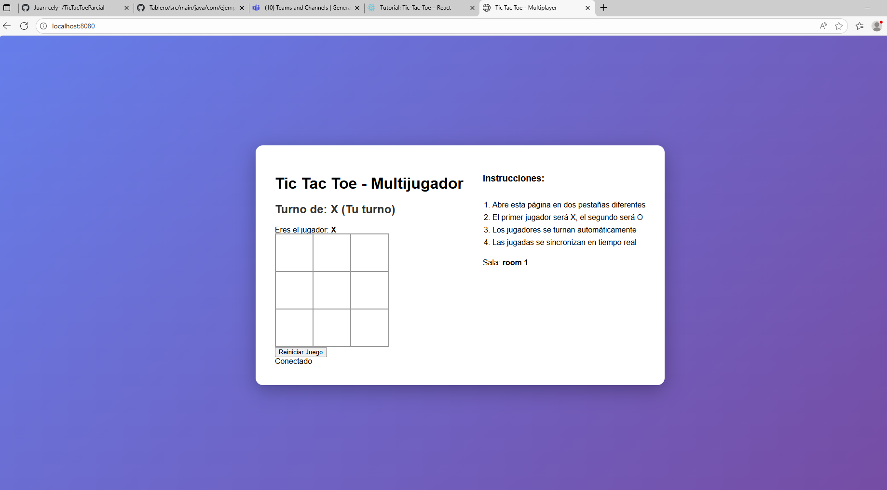
2.
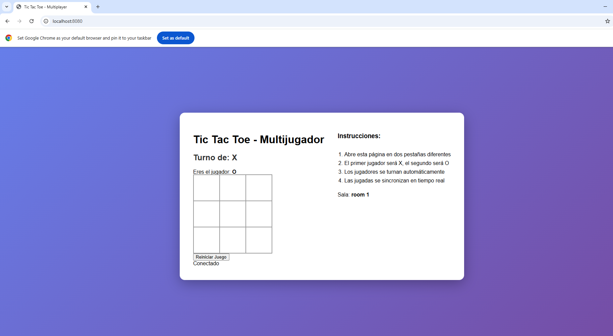
3.
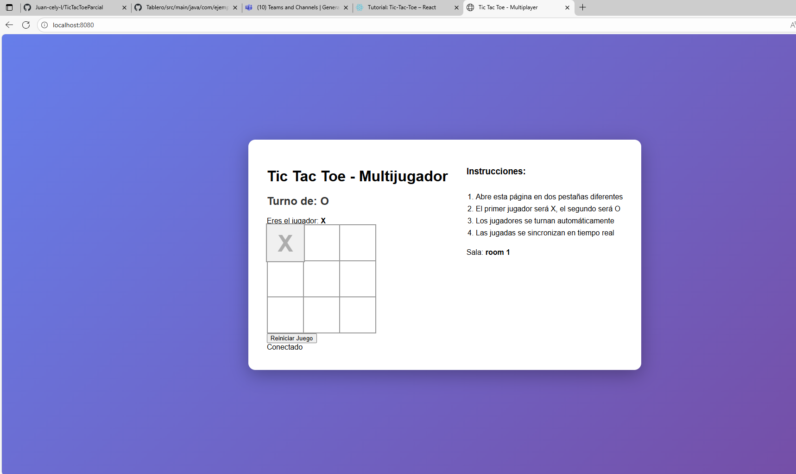
4.
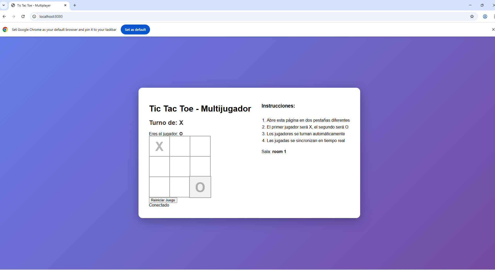
5.
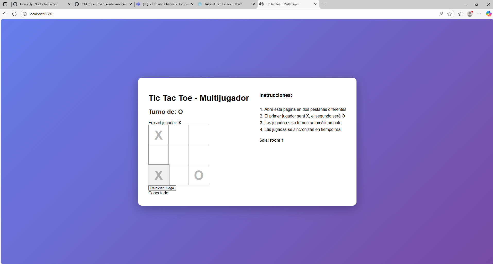
6.
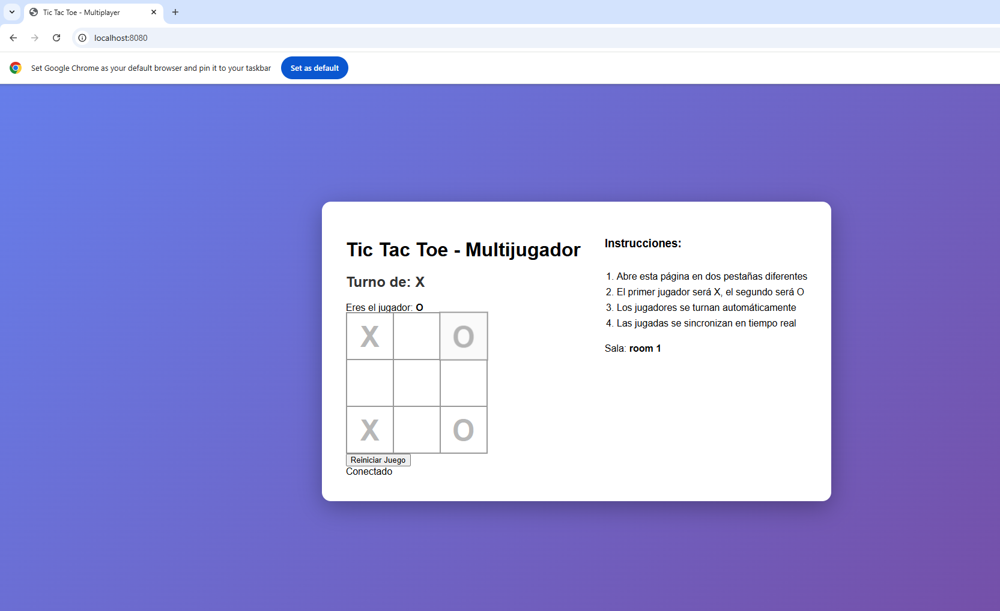
7.
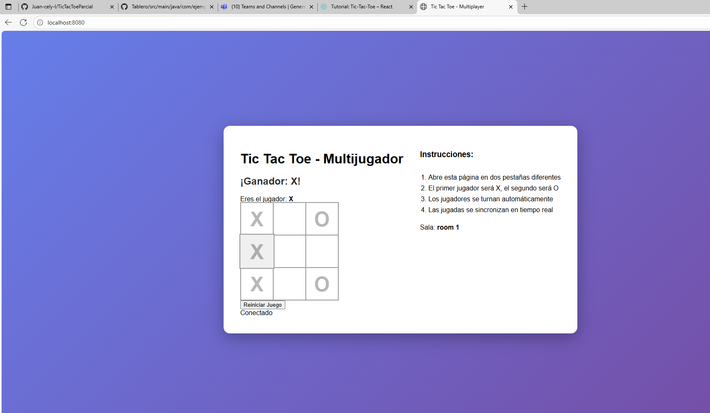

### Reiniciando la partida

1.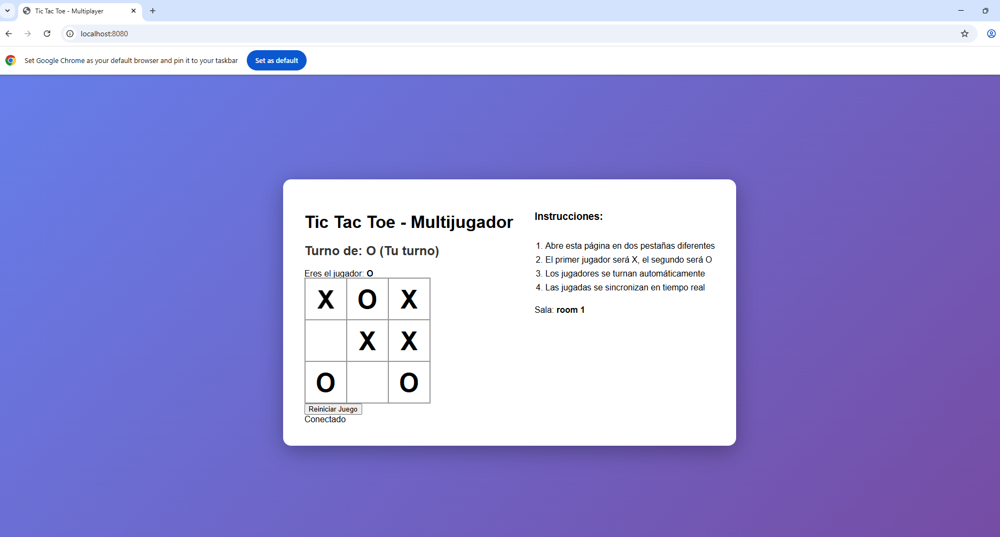

2.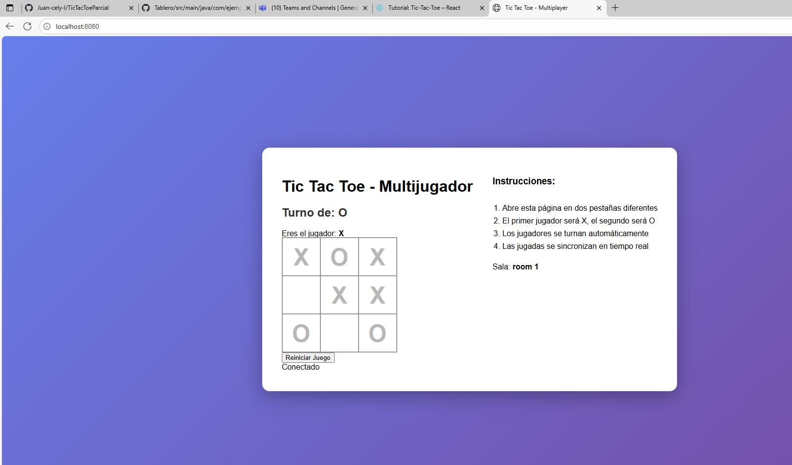

3. 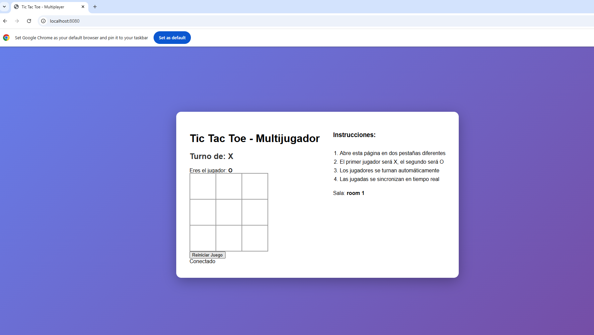

4. 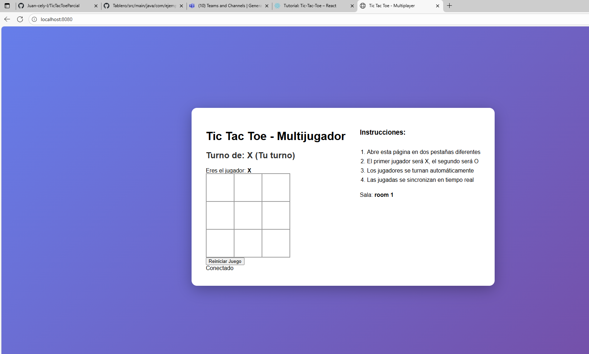


